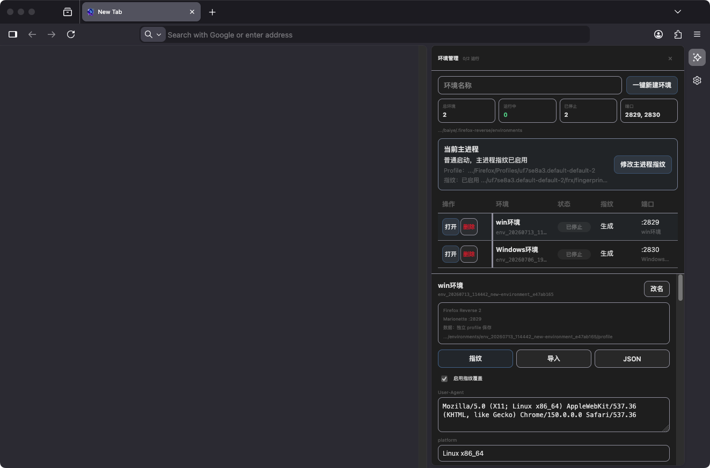

<div align="center">


# Firefox‑Reverse

**一个内置 AI 逆向工程师的 Firefox**

把网页里的加密 / 签名 / 风控参数，从「黑盒」做成「可独立运行、不依赖浏览器的纯算法」。

<br>


<br>

[**📥 下载安装（Releases）**](../../releases)　·　[快速开始](#-快速开始5-步)　·　[工具大全](#-工具大全60)　·　[从源码构建](#-从源码构建)

</div>

---

## 概述

很多网站发请求时会带一个**加密参数**——签名 `sign`、令牌 `token`、风控指纹等。想在浏览器之外（你自己的 Node / Python 脚本里）复现这个请求，就得搞清楚这个参数**是怎么算出来的**。这就是 **JS 逆向**，而它通常很难：逻辑被**混淆**、塞进 **JSVMP（JS 虚拟机保护）**、或编译成 **WASM**，还深度依赖一堆**浏览器环境指纹**。传统做法要在 DevTools 里手动下断点、补环境、反复试值，耗时且容易兜圈。

**Firefox‑Reverse 把这套活儿交给一个内置的 AI Agent。** 它住在浏览器侧边栏里，能像一名专业逆向工程师那样**自己**抓包、读代码、在**引擎 C++ 内核层**打点（页面察觉不到）、补环境、写脚本、实打接口验证——目标是把一个加密参数还原成**你能在 Node.js 里独立跑出来的纯算法**。

> 与「AI + 普通浏览器自动化」最大的不同：它的关键观测工具（签名器入参追踪 / JSVMP 逐指令 trace / WASM import 边界 / 引擎级分支差分）都做在 **SpiderMonkey/Gecko 的 C++ 引擎里**——这些是**页面 JS 反射不到、检测不出**的「上帝视角」，对抗反调试 / 反 hook 的强站点尤其关键。

---

## 功能预览

### 内置 AI Agent


- Agent 常驻浏览器侧边栏，当前接入 **60+ 个工具**，覆盖页面操作、网络抓包、代码搜索、Cookie、WebAPI trace、JSVMP、WASM、文件读写与 Node/Python 实打验证。
- 支持**全自动**与**AI辅助**两种工作方式：既可以让 worker 独立推进，也可以由人或外部 MCP director 分阶段领航。
- 工作目录、会话、阶段结论与生成脚本均落在本地；切换标签页或收起侧边栏不会中断正在运行的父进程 Agent。

### 指纹环境管理



- 一个环境对应一个**独立 Firefox profile + 独立浏览器进程 + 独立 Marionette 端口**，Cookie、历史记录、LocalStorage、缓存和配置互不混用。
- 在侧边栏中可新建、重命名、打开、关闭、删除和导入环境，并查看运行状态、端口、profile 与当前主进程指纹。
- 支持一键生成或粘贴导入 `fingerprint.json`；启动时由 C++ 配置层读取，对 navigator、screen、语言、时区、UA 与请求头等字段进行进程级覆盖。
- 环境能力同时暴露为 `env_*` 工具，可由内置 Agent 或 `frx-director-mcp` 查询和启动指定环境。

> 当前采用**环境级隔离**，不是标签页级切换。指纹配置按进程启动读取，修改运行中环境后需关闭并重新打开才会完整生效。

---

## 🚀 快速开始（5 步）

**① 下载安装**
到本仓库的 [**Releases**](../../releases) 页，按你的系统下载安装包：

| 系统 | 文件 | 安装 |
|---|---|---|
| **Windows** | `firefox-*.win64.zip` | 解压，双击 `firefox.exe`（若 SmartScreen 拦截 → 「更多信息」→「仍要运行」）|
| **macOS (Apple Silicon)** | `firefox-reverse-*-macos-arm64.dmg` | 打开 → 拖进「应用程序」；**首次打开若提示「已损坏」见下方 ⚠️** |
| **macOS (Intel)** | `firefox-reverse-*-macos-x86_64.dmg` | 适用于 Intel Mac（macOS 10.15+）；安装方式同上 |
| **Linux (x86_64)** | `firefox-*.linux-x86_64.tar.xz` | 解压，运行 `./firefox` |

> ⚠️ **macOS 首次打开提示「"Firefox Reverse" 已损坏，无法打开」？** 这**不是真的损坏** —— 本浏览器是自签名应用、未做 Apple 付费公证（$99/年），从浏览器下载后会被系统打上「隔离」标记，Apple Silicon 上就报这个。打开「终端」执行一行去掉隔离即可正常打开：
> ```bash
> xattr -dr com.apple.quarantine "/Applications/Firefox Reverse.app"
> ```
> （路径换成你的实际安装位置；或：系统设置 → 隐私与安全性 → 拉到底点「仍要打开」。）

**② 打开 AI 侧边栏**
启动浏览器 → 点右侧边栏的 **Firefox‑Reverse** 工具图标（机器人/逆向图标），打开 Agent 面板。

**③ 配置一个大模型 Key**（用一次配一次，存本地）
点面板右上角 ⚙️ 设置 → 选一个模型供应商，填上你的 API Key：
- 支持 **DeepSeek**、**智谱 GLM**、**Kimi（Moonshot）**、**MiniMax**、**通义千问（Qwen）**、**Claude**、**OpenAI**，或任何 **OpenAI / Anthropic 协议兼容**的自定义端点（填 baseUrl + token + 模型名即可）。

> 💡 **模型选型建议**：简单 / 小站点用便宜模型（如 DeepSeek）即可上手；遇到复杂 / 大站点，弱模型在长链路里容易走弯路——这类目标建议用「自定义模型」端点接入 **Opus 4.8 或最新旗舰模型**，逆向推进更稳、少绕路。

**④ 新建会话 → 选模式**
点「新对话」，会弹出选择卡：
- **⚡ 全自动** —— 给它目标接口/参数，它一条龙自己搞定（适合放着跑）；
- **🧭 AI辅助** —— 它先出方案、每做完一个阶段就停下、给你方向选项，你来拍板、逐步推进（适合边看边学、复杂目标）。

**⑤ 把目标告诉它**
按下面这个格式把任务说清楚（信息越具体，AI 越少走弯路）：

```
【站点URL】https://example.com/list          # 能看到目标请求的页面
【接口URL】GET https://example.com/api/v1/list?page=1   # 你最终想复现的请求
【目标参数】请求头里的 X-Sign（签名）。若还有其他动态参数（时间戳 / 设备指纹 / token 等）一并列出
【输出目标】① 黑盒可用版：用 Node.js 还原参数生成算法，脱离浏览器独立把接口请求成功
　　　　　　② 白盒纯算版：进一步把它还原成不依赖原始混淆代码的纯 JS 实现（可选）
```

然后看它自己抓包、定位、补环境、实打验证。产物（脚本、还原代码、笔记）都会落到你为这个会话指定的**工作目录**里。

<details>
<summary><b>新手名词速查（点开看）</b></summary>

- **签名 / 加密参数**：请求里一段算出来的字符串（如 `sign` `token` `X-Bogus`），服务端用它校验请求是否合法。
- **补环境**：签名算法常依赖浏览器特有的东西（`navigator`、DOM、`crypto` 等）。在 Node 里把这些「假装」提供出来，让算法能跑，就叫补环境。
- **JSVMP**：把 JS 编译成自定义「字节码 + 解释器」，看不到原始逻辑、极难读，是常见的强保护。
- **WASM**：把算法编译成二进制模块，浏览器直接执行，源码不可见。
- **白盒纯算**：彻底搞懂算法、用普通代码重写，最终**不再需要原始的 JSVMP/WASM 二进制**。
- **工作目录**：你为一个会话指定的本地文件夹，Agent 的抓取脚本 / trace / 还原代码 / 进度笔记都存这里。

</details>

---

## ✨ 核心亮点

- **🧠 内置自主 Agent** —— 不是聊天框，是能连续调用 60+ 工具、自己跑完「抓包→定位→验证→补环境→实打」全流程的逆向智能体。
- **🪪 指纹环境隔离** —— 一个环境一个 profile + 独立进程，支持环境 CRUD、指纹生成/导入、主进程指纹与 MCP 指定环境启动。
- **🔬 引擎层「上帝视角」工具** —— 签名器入参、JSVMP 逐指令、WASM import 边界、浏览器真值 vs Node 复刻的分支差分，全部在 C++ 引擎里观测，**页面检测不到、反调试挡不住**。
- **🎛 两种工作模式** —— 全自动一条龙 / AI辅助逐阶段（你领航），按会话持久化、随时切换。
- **🌐 站点无关** —— 面向**通用** JS / JSVMP / WASM / 签名逆向，不为任何特定网站定制；案例只是测试样例。
- **🔌 任意大模型** —— DeepSeek / 智谱GLM / Kimi / MiniMax / 通义千问 / Claude / OpenAI 及任意 OpenAI/Anthropic 协议兼容端点，Key 存本地、不外传。
- **💾 跨会话记忆** —— 确认过的事实 / 踩过的坑沉淀进内置 SQLite，下次不再兜圈。
- **🧩 常驻引擎** —— 对话引擎跑在父进程系统模块，切侧栏 / 关窗口都不中断，多窗口工作目录互相隔离。

---

## 🤖 两种工作模式

首次新建会话时选择，整条会话沿用（顶部模式标可随时切换）：

| | ⚡ 全自动 | 🧭 AI辅助 |
|---|---|---|
| **节奏** | 给目标 → 一条龙跑到底 | 先出方案 → 逐阶段停下 → 你选方向 |
| **打扰** | 中途不打扰，只在真需要你（登录态/验证码/纯业务决策）或完成时停 | 每做完一个阶段（入口定位 / 字节trace / DOM-API分析 / 构造实现）就停下汇报、给 2–3 个方向选项 |
| **适合** | 放着跑、目标清晰、信任模型 | 复杂目标、想边看边学、想自己把控方向 |
| **价值** | 省心 | 弱模型 + 人类领航 = 少走死路，复杂案例更稳 |

> **🧭 AI辅助模式的「领航」可以是人，也可以是另一个强模型 —— 两种玩法：**
>
> - **① 人工领航** —— 你读它每个阶段的结论、给方向修正，手把手把它从弯路里带出来。
> - **② MCP 自动领航（成本拆分）** —— 让一个**强模型 director**（Claude / GPT 等最新旗舰）通过 **MCP** 自动「**指挥**」浏览器里这个内置逆向 Agent：浏览器 Agent 由一个**便宜的 worker 模型**（如 DeepSeek / 通义千问 / GLM）在 **AI辅助模式**下实操、**磨所有工具活**；**director 只读阶段结论、做方向修正**，不亲自跑工具。贵模型的判断力 + 便宜模型不知疲倦地磨工具，按 token 成本拆分（贵模型每轮只花一点点，便宜模型付掉所有 grinding）。
>   配套 MCP 仓库 → **[frx-director-mcp](https://github.com/WhiteNightShadow/frx-director-mcp)**（**开箱即用**：接好 MCP 后，把它 README 里的「🟢 一键贴给你的 AI」那**一整段复制给你的 director**，它会自己自检环境、缺啥用一句话引导你补齐、然后自动建目录 / 选 AI辅助 / 新建会话 / 下任务 / 读结论 / 回怼方向、循环到出结果——你只需在它问的时候给**目标站**）。
>
>   💡 **worker 模型选型（重要）**：MCP 这种长工具循环里，worker 务必用**标准 / 快速档**，推荐 **`deepseek-v4-flash`** —— 实测零漂移、约 2–3 分钟/阶段、配合最顺。**切勿用推理档**（如 `deepseek-v4-pro`）：推理档在长循环里易退化成「只吐纯文本计划、不再调用工具」而中断，是 worker 的首要失败模式。可在浏览器 Agent ⚙️ 设置里把 worker 设为该档，或让 director 在 `agent_start({ model: "deepseek-v4-flash" })` 里临时指定（同一个 Key、无需改配置）。

---

## 🎯 二阶段：黑盒可用 → 白盒纯算

Agent 的推进遵循一条务实路线——**先拿到能用的，再追求吃透的**：

1. **黑盒可用版**：Node 补环境**跑原始 WASM/JSVMP**，以「**本地生成的签名实打目标接口、服务端返回有效数据**」为准。✅ JSVMP / WASM 两种载体都成熟。
2. **白盒纯算**：把内部算法**抠出来、纯代码重写**，彻底不依赖原始二进制。✅ JSVMP 工具链齐全且实战验证；WASM 提供反汇编（WAT）+ 引擎级分支诊断，可深入分析。

---

## 🧰 工具大全（60+）

Agent 可自主调用的工具，按用途分类：

| 类别 | 工具 | 说明 |
|---|---|---|
| **页面自动化** | `page_navigate` `page_click` `page_scroll` `page_type` `page_eval` `page_screenshot` `page_elements` `page_info` | 导航 / 点击 / 滑动 / 填表 / 执行 JS / 截图 / 取元素 |
| **网络** | `net_capture` `net_list` `net_get` `net_intercept` `hook_inject` `find_param_entry` | 抓包、看请求详情（含**发起者调用栈**）、拦改、**document-start 注入 hook**（抓首屏/刷新就发的请求）、定位参数入口 |
| **🔑 签名器 / 闭包追踪** | `signer_trace` `closure_read` | **引擎层 Debugger** 抓签名函数**真实入参** + 读**闭包变量真值**（dispatcher / 运行时解出的字节码 / RC4 S-box / 常量池——`page_eval` 够不到的，页面无感） |
| **代码 / 脚本** | `code_search` `scripts_list` `scripts_save` `scripts_capture_all` | 在语料 + 工作目录里搜代码、落盘脚本 |
| **WebAPI 指纹** | `webapi_trace` `webapi_query` | 记录页面读了哪些 `navigator`/`document`/`canvas`… 指纹 |
| **🔒 JSVMP 白盒** | `jsvmp_trace` `jsvmp_split_dispatcher` `dispatcher_probe` `jsvmp_disassemble` `jsvmp_query` `jsvmp_status` | 逐 op trace → 识别派发器（结构无关 `dispatcher_probe` 兜底 switch/if-else/跳转表）/解码 → 字节反汇编 → 还原算法 |
| **🔎 密码学识别** | `crypto_scan` | 一眼识别 RC4 的 S-box、XXTEA 的 delta、MD5/SHA 的 IV、AES 的 S-box/Te 表、SM4、自定义 base64 字母表——判型不再暴力扫常量 |
| **🧬 WASM** | `wasm_probe` `wasm_disasm` | import-trace（探 WASM 读的 DOM/env 边界）、`.wasm`→可读 **WAT** |
| **🩺 白盒诊断** | `whitebox_diff` | **浏览器真值 vs Node 复刻**的引擎级分支差分——把「黑盒兜圈试值」变成「白盒定位是哪条分支/哪个 env 带偏」，全程非侵入 |
| **通用 JS trace** | `js_trace` | AST 插桩 + Node 执行，逐函数追踪（非 JSVMP 的普通 JS） |
| **执行 / 文件** | `run_node` `run_python` `npm_install` `fs_read` `fs_write` `fs_list` `fs_copy` `fs_mkdir` | 在工作目录跑脚本、实打验证、读写文件 |
| **🍪 Cookie 管理** | `cookies`（action：list / set / remove） | 列出（含 **httpOnly**，`document.cookie` 拿不到的）/ 新增改 / 删除 cookie——经引擎 `nsICookieManager`，可管理登录态 |
| **方法论 / 记忆** | `skill_get` `notes_add` `notes_get` | 拉取内置逆向方法论、跨会话沉淀站点经验 |

---

## 🖥 平台与下载

| 平台 | 架构 | 状态 |
|---|---|---|
| **Windows** | x86_64 | ✅ 提供安装包（持续完善中，欢迎反馈） |
| **macOS** | Apple Silicon (arm64) | ✅ 提供安装包 |
| **macOS** | Intel (x86_64) | ✅ 提供安装包 |
| **Linux** | x86_64 | ✅ 提供安装包 |

安装包在 **Linux 构建机上交叉编译**（macOS arm64 / macOS x86_64 / Windows64 / Linux x86_64）后发布到 [Releases](../../releases)。macOS 两种架构使用独立对象目录构建，并在发布前校验 DMG 内主程序架构与签名。

---

## 🏗 从源码构建

> 只想用的话直接去 [Releases](../../releases) 下载即可，无需自己编译。

本仓库是 **Firefox 的「补丁集」**（`additions/`），不含 Firefox 源码本身。构建流程：

```bash
# 1. 取得 Firefox 153.0a1 源码到 upstream/（首次）
#    （见 scripts/，或用 mach 的标准 bootstrap）

# 2. 应用本仓库的 additions（agent-sidebar + 引擎层 C++ 补丁）
bash scripts/apply-patches.sh

# 3. 编译 + 打包
cd upstream && ./mach build && ./mach package
```

- 前端（侧栏 React UI）：`additions/browser/components/agent-sidebar/`，`npm run build` 出 bundle。
- 引擎补丁（非侵入 trace）：`additions/js/...`、`additions/dom/...` 的 C++。
- 自动化构建脚本见 `.github/workflows/release.yml`。

---

## 🏛 架构

```
┌─────────────────────────── Firefox‑Reverse ───────────────────────────┐
│                                                                        │
│  侧边栏 React UI (omni.ja)         常驻引擎 (父进程系统模块, .sys.mjs)   │
│  ├ 对话 / 模式选择卡 / 工作目录    ├ AgentSession  跨面板重载存活        │
│  └ 仅订阅快照、不持业务态          ├ AgentLoop     工具循环/上下文压缩    │
│                                    ├ ToolRouter    40+ 工具路由          │
│                                    └ ConfigStore / Memory (SQLite)      │
│                                                                        │
│  引擎层 C++ 打点（页面无感、反射不到）                                   │
│  ├ JSVMP 逐指令 trace（SpiderMonkey 解释器插桩）                         │
│  ├ WebAPI 指纹 trace（DOM 边界）                                         │
│  └ 覆盖率/分支 差分（whitebox_diff）                                     │
└────────────────────────────────────────────────────────────────────────┘
        最终产物：一段 Node.js / Python 纯算法，不再需要浏览器
```

---

## ❓ FAQ

- **要不要懂编译 / 配环境？** 不用。下载 Releases 安装包即可，配个大模型 Key 就能用。
- **支持哪些大模型？** DeepSeek / 智谱GLM / Kimi（Moonshot）/ MiniMax / 通义千问（Qwen）/ Claude / OpenAI，以及任何 OpenAI/Anthropic 协议兼容的自定义端点。Key 只存本地。
- **我的 Key / 数据会上传吗？** 不会。Key 存在本地浏览器配置里，只用于直连你选的大模型端点。
- **全自动和 AI辅助选哪个？** 目标清晰、信任模型 → 全自动；复杂 / 想把控方向 / 想学 → AI辅助。
- **能保证破解任何站点吗？** 不能。强保护（深度 JSVMP / 自带密钥的 WASM）依然很难；本工具是把分析效率拉满，不是银弹。

---

## ⚖️ 法律与授权声明

本项目是面向**安全研究、接口对接、授权测试**的逆向分析工具。使用者须对自己的行为负责：

- **仅在你拥有合法授权的目标上使用**（你自己的平台、获得授权的测试对象、CTF / 教学等）。
- **不得**用于未授权访问、绕过他人系统的安全机制、大规模抓取或任何违反目标方服务条款 / 当地法律的行为。
- 作者与贡献者不对任何滥用行为负责。下载即表示你已理解并同意上述条款。

---

## 📝 版本更新记录

### v0.22.2（2026-07-13）
- **新增 Intel Mac Release**：增加 `x86_64-apple-darwin` 独立构建配置和 `macos-x86_64` DMG，支持 Intel Mac（macOS 10.15+）。
- **macOS 架构防错**：发布流程分别构建 arm64 / x86_64，并在 DMG 校验时核对真实 Mach-O 架构；新增跨平台产物在 macOS 上 ad-hoc 重签与重打包脚本。
- **环境启动卡顿修复**：打开指纹环境后等待 Marionette 端口真实就绪再显示“运行中”，正确通过 Marionette pref 分配端口，并持续消费子进程输出，避免 Windows 冷启动期间误判和管道阻塞。

### v0.22.1（2026-07-13）
- **Windows 环境状态修复**：`tasklist.exe` / `taskkill.exe` 改用绝对路径，浏览器已经打开后不再被环境管理误判为“已停止”。
- **PID 三态探测**：进程状态区分 `alive`、`dead`、`unknown`，系统探测异常时保留原运行状态，不再破坏 runtime 数据。
- **多环境端口避让**：分配 Marionette 端口前执行真实 loopback 绑定检查，同时优先使用当前后端进程句柄，减少重复查询和端口冲突导致的启动卡顿。
- **Windows 回归测试**：新增系统命令解析、状态刷新、进程句柄优先和多环境端口分配测试，并纳入一键 Agent 工具自测。

### v0.22.0（2026-07-07）
- **指纹浏览器环境管理**：新增环境实体与独立 profile / 独立进程运行链路，支持环境列表、新建、重命名、打开、关闭、删除、导入指纹 JSON。
- **侧边栏环境管理**：Agent 侧边栏新增明显的环境管理入口，可维护环境状态、编辑当前主进程指纹、保存后重启生效，并支持一键还原默认。
- **首批 C++ 指纹覆盖**：启动时读取环境或当前 profile 的 `fingerprint.json`，覆盖 `navigator.userAgent/platform/language/languages/webdriver/hardwareConcurrency`、`screen.*`、`devicePixelRatio`、timezone / locale、`User-Agent` / `Accept-Language` headers 等低风险字段。
- **Chrome-like 指纹生成与导入**：支持按 OS、版本、语言、分辨率、DPR、时区生成一致组合；支持外部浏览器控制台采集 JSON 后粘贴导入。
- **MCP 环境联动**：配合 `frx-director-mcp` 通过 `FRX_ENV_ID` 启动指定环境，并保留无环境时的主进程 profile 指纹模式。
- **macOS 包修复**：修复本地覆盖安装后的签名/启动问题，重新生成签名 DMG 与 SHA256 校验文件。

### v0.19（2026-06-10）
- **新增模型**：Kimi（Moonshot，`kimi-k2.6`）、MiniMax（`MiniMax-M3`）、通义千问（Qwen，`qwen3-max`）—— 连同原有 DeepSeek / 智谱 GLM / Claude / OpenAI，主流大模型基本覆盖。
- **MCP 外部驱动可见性**：新增 `AgentSession.listRunning()` + 侧栏「空闲自动跟随 / 忙时横幅」——外部（如 MCP director）驱动的会话能在侧栏**自动切到、实时流式、并显示绑定的工作目录**（配套 [frx-director-mcp](https://github.com/WhiteNightShadow/frx-director-mcp) 成本拆分玩法，见「两种工作模式」）。
- **「停止」即时生效（框架级修复）**：`run_node` / `run_python` 卡住时点停止会**立刻杀掉子进程**（之前要干等到超时才结束）；`run_node` 默认超时 **300s → 30s**（正常 JS 加载足够，hang 住能更快释放）。
- **工具补齐**：`crypto_scan`（密码学常量识别）、`closure_read`（引擎层读闭包变量真值）、`hook_inject`（document-start 注入 hook）、`dispatcher_probe`（结构无关 JSVMP 派发器探测）—— 工具数 40+ → **44+**。
- **方法论 / 健壮性**：简单站「快车道」判型（先 hook 对比标准算法、不硬扣混淆）、`page_eval` 全权 + 大输出 `saveTo` 落盘、SSR 站识别、长任务护栏对强模型软化（硬限制转软提示、随上下文窗口缩放）。

### v0.17 – v0.18（2026-06-08 起）
- 三端（Windows / macOS / Linux）正式构建并发布到 Releases；上下文窗口按所选模型自动缩放（`modelBudget`，长逆向不再轻易截断）；持续打磨 skill 方法论、工具稳定性与长任务健壮性。

### 更早（v0.12 – v0.16）
- JSVMP 离线工具链（派发器拆分 / 字节反汇编）封成一等工具；通用 **WebAPI 指纹 tracer**（C++ 引擎层、页面无感）；**WASM** 边界探测 `wasm_probe` + 反汇编 `wasm_disasm`；通用 JS 逐函数 trace `js_trace`；签名器入参追踪 `signer_trace`；白盒分支差分 `whitebox_diff`；内置逆向方法论 `skill_get` + 跨会话 **SQLite 记忆** + 反绕圈护栏；对话引擎挪到父进程**常驻**（切窗 / 关侧栏不中断）。

---

## 🔑 外部支持 · 模型 Key 申请

Firefox‑Reverse Key 直连你选的模型，**Key 只存本地、不经第三方**。下面整理了各模型的 Key 申请入口，按需自取：

| 模型 / 服务 | 说明 |
|---|---|
| [**DeepSeek**](https://platform.deepseek.com/usage) | 性价比高，Agent 默认推荐 |
| [**智谱 GLM**](https://open.bigmodel.cn/) | |
| [**Kimi（Moonshot）**](https://platform.moonshot.cn/) | |
| [**MiniMax**](https://platform.minimaxi.com/) | |
| [**通义千问（Qwen）**](https://bailian.console.aliyun.com/) | 阿里云百炼 |

> **接入方式**：以上均为 Agent ⚙️ 设置里的**内置供应商**，选中、填 Key 即可用；其它 OpenAI / Anthropic 兼容端点选 **「自定义」**，填入 baseUrl + Key + 模型名即可。

---

## 📮 反馈 / 联系

使用中遇到问题、想反馈 bug、或交流逆向思路，欢迎加微信或进群反馈：

> **微信号：`han8888v8888`**（加好友请备注「Firefox-Reverse」）

也可以扫码加入 **AI爬盒** 微信群，交流 Firefox-Reverse、Agent、指纹环境和 JS 逆向实践：


---

## License

[MPL‑2.0](https://www.mozilla.org/MPL/2.0/) —— 与上游 Firefox 一致。本项目为 Firefox 的衍生作品，相关商标归 Mozilla 所有。
